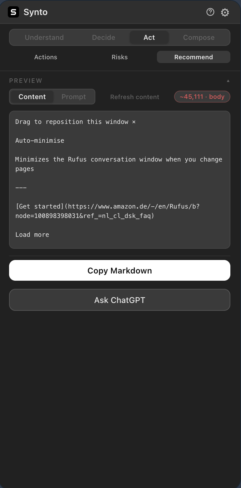
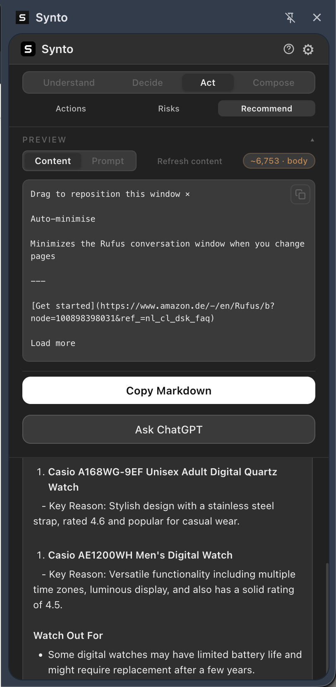
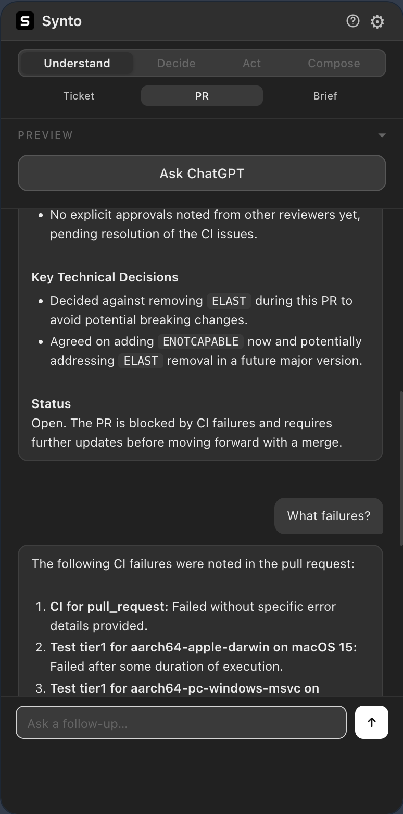
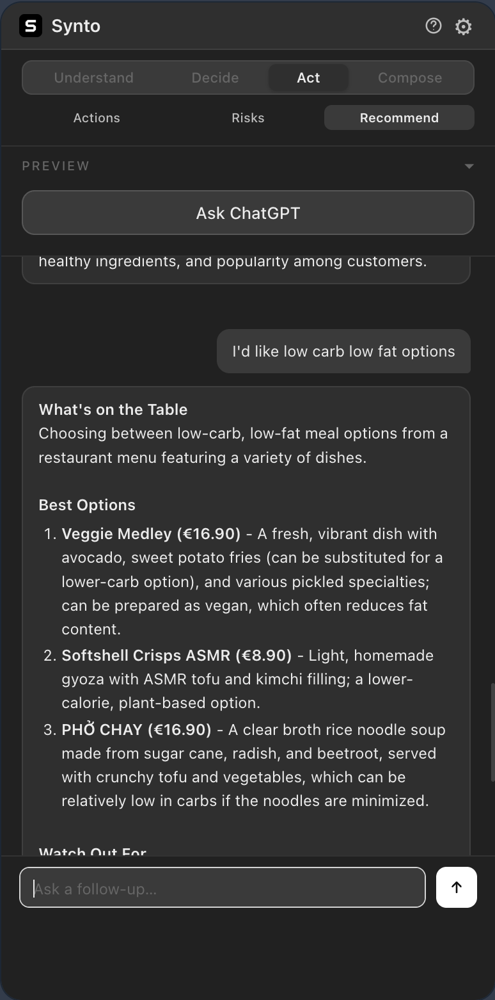

#  Synto

Turn messy tickets, PRs, and docs into structured AI briefs — in one click, from a Chrome side panel.

Clip any page to clean Markdown, apply a prompt template, and send to ChatGPT, Gemini, or Grok. No backend. No accounts. API keys stay on your device.

<table>
  <tr>
    <td width="50%"></td>
    <td width="50%"></td>
  </tr>
  <tr>
    <td width="50%"></td>
    <td width="50%"></td>
  </tr>
</table>

---

## ⚡ Quick Install

1. [📦 Download synto.zip](https://github.com/artttj/synto/releases/latest) and unzip it
2. Open `chrome://extensions` → enable **Developer mode** → **Load unpacked** → select the `dist/` folder
3. Click the **Synto** icon → gear icon ⚙️ → **AI Connections** → paste your API key → **Save**

> Need a free API key? [Google AI Studio](https://aistudio.google.com/app/apikey) offers a free Gemini key with no credit card required.

---

Built for **engineers, PMs, and founders** who are tired of the copy-paste-summarize loop — skip the prep work and get straight to insights you can act on.

- [Why Synto?](#why-synto)
- [Features](#features)
- [Templates](#template-library)
- [Workflow Examples](#workflow-examples)
- [Privacy & Data](#privacy--data)
- [Setup](#setup)

---

## Why Synto?

- **Context-aware extraction** — tuned for Jira, GitHub, GitLab, and Bitbucket
- **Templates by intent** — structured prompts for analysis, decisions, and action items
- **Multi-AI support** — ChatGPT, Gemini, and Grok in one place
- **Fully client-side** — no backend, no tracking; API keys never leave your device

---

## Before & After

**Without Synto:** Copy a 200-comment Jira ticket, paste it into ChatGPT, type "summarize this", and get a generic paragraph that misses the technical nuances.

**With Synto:** Open the side panel, select **Ticket Analysis**, click **Ask ChatGPT**, and get a structured brief streamed in seconds:

```
## Summary
Auth service timeout caused by Redis connection pool exhaustion.

## Acceptance Criteria
- Pool size configurable via env var.
- Graceful degradation (queueing) when pool is full.
- Load test at 500 RPS passes.

## Risks & Edge Cases
- Increasing pool size may exhaust Redis server connections.
- Queue depth needs a cap to avoid memory growth.

## Next Steps
1. @backend: Spike connection pooling library options.
2. @devops: Check current Redis maxclients value.
```

**Ask ChatGPT / Gemini / Grok** streams the response in the panel. **Copy Markdown** copies the prompt to clipboard for Claude, ChatGPT web, or any other tool you already use.

---

## Template Library

Templates are grouped by intent and support `{content}`, `{selection}`, `{title}`, and `{url}` placeholders.

| Category | Templates | Purpose |
| --- | --- | --- |
| **Understand** | Structured Brief, Ticket Analysis, PR Review | Identify key points, conclusions, and technical risks. |
| **Decide** | Decision Brief, Feature Request Analysis | Weigh trade-offs and define a recommendation. |
| **Act** | Extract Actions, Risks & Blockers, Smart Choice | Turn discussions into tasks and surface blockers. |
| **Compose** | Draft Reply, Rewrite Comment, Email Helper | Generate professional responses or polished rewrites. |

*Custom templates can be added in the **Options** menu.*

---

## Features

### Smart Extraction

Synto knows where the real content lives on Jira, GitHub, GitLab, and more.

- **Semantic focus:** targets `<article>`, `<main>`, `#issue-content` (Jira), `.js-discussion` (GitHub), `#pullrequest-diff` (Bitbucket), `.diff-files-holder` (GitLab), and more
- **Clean Markdown:** strips navigation, footers, ads, and banners via [Turndown](https://github.com/mixmark-io/turndown) + GFM tables/code blocks; diff tables converted to readable `<pre>` blocks
- **Selection awareness:** highlight text before opening the panel and Synto uses that as `{selection}`

### Integrated Experience

Everything happens in a persistent side panel — no tab switching, no lost context.

- **Multi-model AI:** stream responses from **GPT-4o-mini**, **Gemini 2.0 Flash**, or **Grok-3-mini** directly in the panel, with full follow-up conversation
- **Live preview:** toggle between the **Content tab** (raw extracted Markdown) and **Prompt tab** (final merged string), with a token counter that warns as you approach model limits
- **Two outputs:** **Ask** streams the response in-panel; **Copy Markdown** copies the prompt to clipboard for Claude, ChatGPT web, or other tools

### ⌨️ Keyboard Shortcuts

| Action | macOS | Windows / Linux |
| --- | --- | --- |
| Open Synto | ⌥⇧C | Alt+Shift+C |
| Ask AI (panel focused) | ⌥⇧↩ | Alt+Shift+Enter |

---

## Workflow Examples

### Engineering: PR review in 30 seconds

1. Open a GitHub PR with 40+ review comments
2. Open Synto → select **PR Review**
3. Click **Ask ChatGPT** → get a structured brief: what changed, who is blocking, what they want fixed
4. Ask follow-up questions directly in the panel

### Product: Jira ticket into a shareable brief

1. Open a Jira ticket with discussion
2. Open Synto → select **Ticket Analysis**
3. Click **Ask ChatGPT** for an in-panel analysis, or **Copy Markdown** to paste the prompt into Claude or another tool

### Decision: evaluate a feature request

1. Open the GitHub issue or internal doc
2. Open Synto → select **Feature Request Analysis**
3. Click **Ask ChatGPT** → get problem framing, trade-offs, and alternatives

---

## 🔒 Privacy & Data

- **Local only:** API keys are stored in `chrome.storage.local` — never synced, never sent to any external server
- **Direct connection:** page content goes straight from your browser to the AI provider; Synto has no visibility into it
- **Zero tracking:** no analytics, no telemetry, no accounts

Provider privacy policies: [OpenAI](https://openai.com/policies/privacy-policy/) · [Google AI](https://ai.google.dev/gemini-api/terms) · [xAI](https://x.ai/legal/privacy-policy/)

---

## Setup

### No-build install

1. [📦 Download synto.zip](https://github.com/artttj/synto/releases/latest) and unzip it
2. Open `chrome://extensions` → enable **Developer mode** → **Load unpacked** → select the `dist/` folder
3. Click the **Synto** icon → gear icon ⚙️ → **AI Connections** → paste your API key → **Save**

### Build from source

1. `git clone https://github.com/artttj/synto.git && cd synto`
2. `npm install && npm run build`
3. Open `chrome://extensions` → enable **Developer mode** → **Load unpacked** → select the `dist/` folder
4. Click the **Synto** icon → gear icon ⚙️ → **AI Connections** → paste your API key → **Save**

> **Tip:** Make sure you selected the `dist/` folder (the build output), not the project root.

### API Keys

| Provider | Model | Free tier | Where to get a key |
| --- | --- | --- | --- |
| Google Gemini | `gemini-2.0-flash` | ✅ Yes | [aistudio.google.com](https://aistudio.google.com/app/apikey) |
| OpenAI | `gpt-4o-mini` | ❌ Paid | [platform.openai.com](https://platform.openai.com/api-keys) |
| Grok (xAI) | `grok-3-mini` | ❌ Paid | [console.x.ai](https://console.x.ai/) |

### Project Structure

```
synto/
├── manifest.json         # Manifest V3 (copied into dist/)
├── src/
│   ├── background/       # Service worker
│   ├── content/          # Extraction logic
│   ├── popup/            # Sidebar UI & chat
│   ├── options/          # Options page
│   └── shared/           # Storage & constants
├── scripts/build.js      # Build pipeline: src/ + icons/ → dist/
└── dist/                 # Load this folder into Chrome
```

---

## License

**MIT** — free to use and modify. Attribution required: include the original copyright notice in all copies or substantial portions. See [LICENSE](LICENSE) for details.
